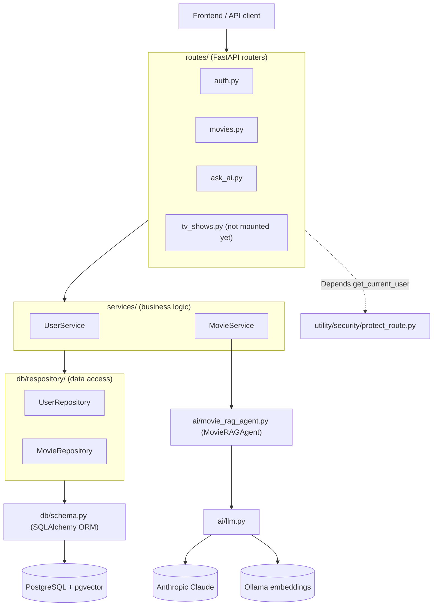
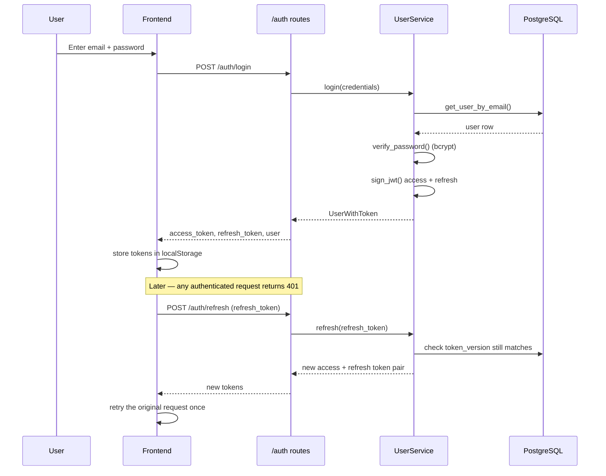
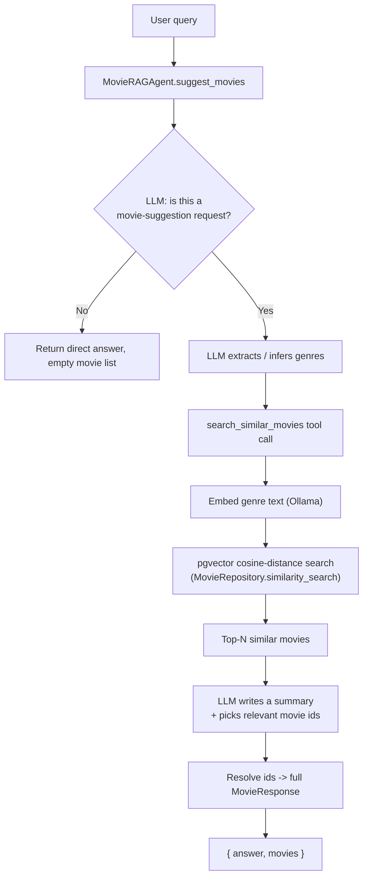

# Play Assist — Backend

FastAPI backend for Play Assist: movie browsing/search, JWT-based auth, and an
AI movie-recommendation agent built with a Retrieval-Augmented Generation (RAG)
pipeline over a PostgreSQL + [pgvector](https://github.com/pgvector/pgvector)
similarity index.

For the full project (frontend + backend + how to run everything together),
see the [root README](../README.md).

## Tech stack

- **FastAPI** + **Uvicorn** — HTTP API and ASGI server
- **SQLAlchemy** + **psycopg2** — ORM / database access
- **PostgreSQL** with the **pgvector** extension — relational storage + vector similarity search
- **LangChain** (`langchain`, `langchain-anthropic`, `langchain-ollama`) — LLM tool-calling agent
- **Anthropic Claude** — the chat model powering the recommendation agent
- **Ollama** (`nomic-embed-text` by default) — local embedding model
- **PyJWT** + **bcrypt** — authentication (access/refresh tokens, password hashing)
- **TMDB API** — source of movie/TV metadata

## Architecture

The backend follows a layered architecture: HTTP routes never touch the
database directly — they call into services, which own business logic and
delegate persistence to repositories.



Key patterns in play:

- **Repository pattern** (`db/respository/base.py` + subclasses) isolates all SQL/ORM code from services.
- **Dependency injection**: FastAPI's `Depends(get_db)` hands each request a scoped SQLAlchemy `Session`, threaded through `Service(session)` → `Repository(session)`.
- **DTOs**: Pydantic models in `models/` are kept separate from the SQLAlchemy ORM models in `db/schema.py`.
- **Singleton**: the LLM and embedding clients (`ai/llm.py`) are lazily created once and reused across requests.
- **Facade**: `MovieRAGAgent.suggest_movies()` hides the LangChain agent + tool-calling machinery behind one call.

## Folder structure

```
backend/
├── ai/                       # LLM clients, RAG agent, in-memory mock store
│   ├── llm.py                 # Singleton factories for chat + embedding models
│   ├── movie_rag_agent.py     # LangChain tool-calling agent (RAG)
│   └── movie_store_mock.py    # In-memory movie store (testing/mocking)
├── db/
│   ├── database.py            # Engine/session setup, init_db(), get_db() dependency
│   ├── db_seeds.py            # Seeds the default admin user on startup
│   ├── schema.py               # SQLAlchemy ORM models (Movie, User)
│   └── respository/
│       ├── base.py            # BaseRepository (holds the session)
│       ├── movie.py           # MovieRepository
│       └── user.py            # UserRepository
├── models/                   # Pydantic request/response models
│   ├── ask_ai.py
│   ├── movie.py
│   └── user.py
├── routes/                   # FastAPI routers (HTTP layer only)
│   ├── auth.py
│   ├── movies.py
│   ├── ask_ai.py
│   └── tv_shows.py            # Not mounted on the app yet
├── services/                  # Business logic
│   ├── movie_service.py
│   └── user_service.py
├── utility/
│   ├── utils.py                # get_env_key() helper
│   └── security/
│       ├── auth_handler.py     # JWT sign/decode
│       ├── hash_helper.py      # bcrypt password hashing
│       └── protect_route.py    # get_current_user FastAPI dependency
├── main.py                    # App entrypoint: middleware, routers, lifespan
├── requirements.txt
└── Dockerfile
```

## Auth flow

Access tokens are short-lived (15 min); refresh tokens (7 days) are used to
silently mint new ones. Logging out bumps the user's `token_version`, which
immediately invalidates every previously issued token for that user.



## AI recommendation flow (RAG)

`POST /ask_ai/query` runs a small LangChain agent (`MovieRAGAgent`) that
decides whether a query is a movie-suggestion request, extracts genres, and
looks up similar movies via a pgvector cosine-distance search over
precomputed embeddings.



Each movie's embedding is precomputed once, at import time
(`MovieService.add_movie`), from its title/overview/release date/language/genres.

## API endpoints

| Method | Path                  | Auth required | Description |
|--------|-----------------------|:---:|-------------|
| POST   | `/auth/signup`         |  | Create a new user account |
| POST   | `/auth/login`          |  | Log in, returns access + refresh tokens |
| POST   | `/auth/refresh`        |  | Exchange a refresh token for a new pair |
| POST   | `/auth/logout`         | ✅ | Invalidate all outstanding tokens for the user |
| GET    | `/auth/me`             | ✅ | Return the current authenticated user |
| GET    | `/movies/load_movies`  |  | Bulk-import popular movies from TMDB (`?pages=`) |
| GET    | `/movies/movies`       |  | Paginated list of stored movies (`?page=`) |
| GET    | `/movies/search`       |  | ⚠️ Currently broken — see note below |
| POST   | `/ask_ai/query`        |  | Ask the RAG agent for movie recommendations |

> **Note:** `GET /movies/search` calls `MovieService.search_movies`, which
> doesn't exist (`MovieService` only has `similarity_search`, which expects an
> embedding, not raw text). This route will raise at request time. It has been
> left as-is intentionally — flagging it here rather than fixing it.

`routes/tv_shows.py` (`/tv_shows/popular`, `/tv_shows/search`) is implemented
but not currently mounted on the app (`main.py` has it commented out — "TV
Series will be implemented later").

None of the routes above currently enforce `is_admin` server-side (e.g.
`/movies/load_movies`); the admin-only restriction on the Settings page today
is frontend-only (the nav link is hidden for non-admins).

## Environment variables

Read from the process environment via `utility/utils.get_env_key()` — see the
[root README](../README.md#environment-variables) for the full list and how
to load them for local (non-Docker) runs.

## Running locally (without Docker)

See the [root README](../README.md#run-without-docker-manual-setup) for the
full manual setup (Postgres + pgvector, Ollama, env vars). Once those are in
place:

```bash
cd backend
python -m venv venv          # if not already created
source venv/bin/activate
pip install -r requirements.txt

# env vars must be exported into the shell — get_env_key() reads os.environ
# directly and does not load .env files itself
set -a && source ../.env && set +a

uvicorn main:app --reload --host 0.0.0.0 --port 8000
```

The API will be available at `http://localhost:8000` (interactive docs at
`http://localhost:8000/docs`). On startup, `init_db()` enables the `vector`
extension, creates tables, and seeds the default admin user.
