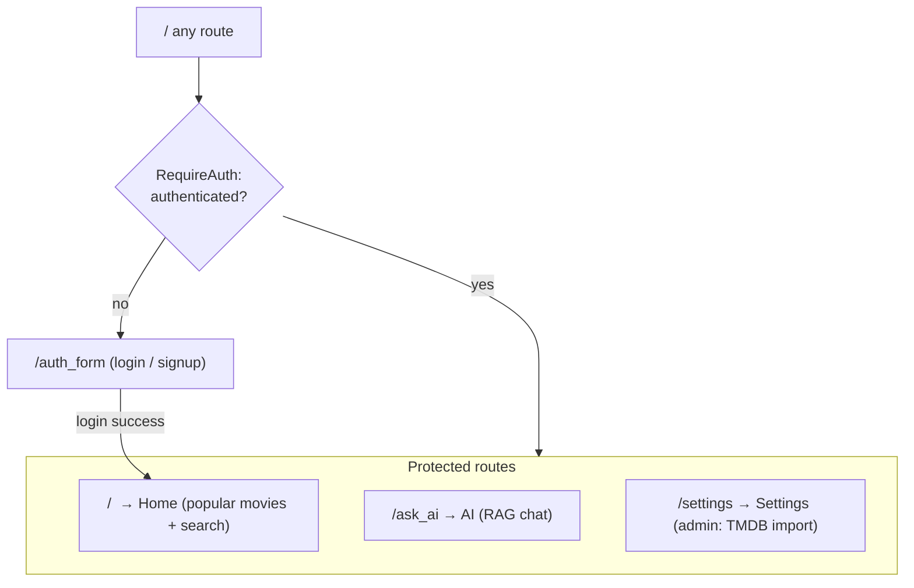

# Play Assist — Frontend

React + TypeScript single-page app for Play Assist: browse/search movies,
ask the AI recommendation agent, and manage your session.

For the full project (frontend + backend + how to run everything together),
see the [root README](../README.md).

## Tech stack

- **React 19** + **TypeScript**
- **Vite** — dev server / build tool
- **React Router 7** — client-side routing
- **Tailwind CSS 4** — styling
- Plain `fetch` (no external HTTP client) for API calls

## Folder structure

```
frontend/
├── src/
│   ├── components/
│   │   ├── MovieCard.tsx       # Poster card used by Home/Favorites/AI pages
│   │   ├── NavigationBar.tsx   # Top nav bar, auth-aware links
│   │   └── RequireAuth.tsx     # Route guard, redirects to /auth_form
│   ├── contexts/
│   │   ├── AuthContext.tsx     # Current user, login/signup/logout
│   │   └── MovieContext.tsx    # Favorites, persisted to localStorage
│   ├── pages/
│   │   ├── Home.tsx            # Popular movies + search
│   │   ├── AI.tsx              # "Ask AI" page (component name is `Home`, see note)
│   │   ├── AuthForm.tsx        # Combined login/signup form
│   │   ├── Favorites.tsx       # Saved favorites (not currently routed)
│   │   └── Settings.tsx        # Admin-only: trigger a TMDB import
│   ├── services/
│   │   ├── api.ts              # fetch wrapper, token storage, one fn per endpoint
│   │   └── types.ts            # Shared types mirroring backend response models
│   ├── App.tsx                 # Routes + global providers
│   └── main.tsx                # App entrypoint
├── package.json
└── Dockerfile
```

> **Note:** `pages/AI.tsx` exports a component literally named `Home` (a
> leftover from copy/pasting `pages/Home.tsx`) — it is in fact the AI query
> page, routed at `/ask_ai`. Left as-is.

## Routing & auth



`AuthContext` hydrates the session on load (calls `GET /auth/me` if an access
token is stored), and listens for a global `auth:logout` event — dispatched by
`services/api.ts` whenever a silent token refresh fails — to drop back to a
logged-out state from anywhere in the app.

## State management

- **AuthContext** (`contexts/AuthContext.tsx`) — current user, `login`,
  `signup`, `logout`. Consumed via `useAuth()`.
- **MovieContext** (`contexts/MovieContext.tsx`) — favorites list, persisted
  to `localStorage`. Consumed via `useMovieContext()`. (The Favorites page
  that reads this isn't currently mounted as a route.)

No larger state library (Redux, Zustand, etc.) is used — just React Context
plus local `useState` per page.

## API integration

All backend calls go through `services/api.ts`:

- `API_BASE_URL` is hardcoded to `http://127.0.0.1:8000` — update this if the
  backend runs elsewhere.
- `authFetch()` attaches the stored access token and, on a `401`, attempts
  exactly one silent refresh (via `/auth/refresh`) before retrying; if the
  refresh itself fails, it clears tokens and dispatches `auth:logout`.
- Access/refresh tokens are stored in `localStorage` (`access_token`,
  `refresh_token`).

## Running locally (without Docker)

```bash
cd frontend
pnpm install
pnpm run dev
```

The app will be available at `http://localhost:5173`. It expects the backend
to be reachable at `http://127.0.0.1:8000` (see [backend/README.md](../backend/README.md)
to run it).

Other scripts:

```bash
pnpm run build     # type-check (tsc -b) + production build
pnpm run lint       # eslint
pnpm run preview    # preview a production build locally
```
